# Generated Module Hierarchy

!!! info "Generated diagram"
    This page is generated from `docs/assets/diagrams/generated/hierarchy.mmd` by `scripts/render_mermaid_svg.mjs`.
    Do not edit the SVG or this page manually. Run `uv run task docs-diagrams` and review the diff.

Code-generated package hierarchy view. Nested groups represent filesystem/package containment, not class inheritance.

Source of truth: [`hierarchy.mmd`](../../assets/diagrams/generated/hierarchy.mmd)
Generated artifact: [`hierarchy.svg`](../../assets/diagrams/generated/hierarchy.svg)

